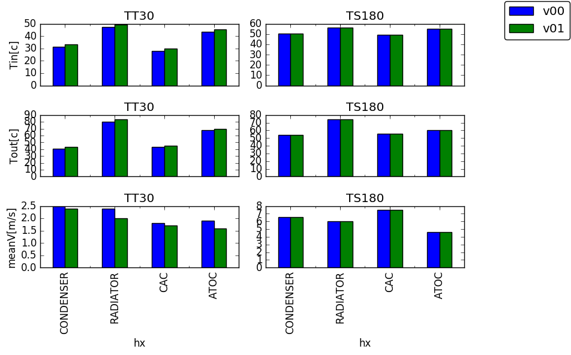

# cfd_results_python
Script for collecting CFD results from output files to dataframes and plotting them

While doing Computational Fluid Dynamics (CFD) analyses it is a typical problem to collect results from output files and compare them for the various geometries and load cases that were run.
[This script](collect_results.py) demonstrates how this post-processing work can be automated using Python. The output files with the CFD results are organized to a directory structure (v00, v01, etc.). The script can then:
* read the output files with the results
* collect them to [pandas](http://pandas.pydata.org/) dataframes
* create plots with [matplotlib](http://matplotlib.org):

* write the data to a spreadsheet (in excel xlsx format)

The example shows some typical data extracted from underhood flow simulations (heat exchanger data, part temperatures).
